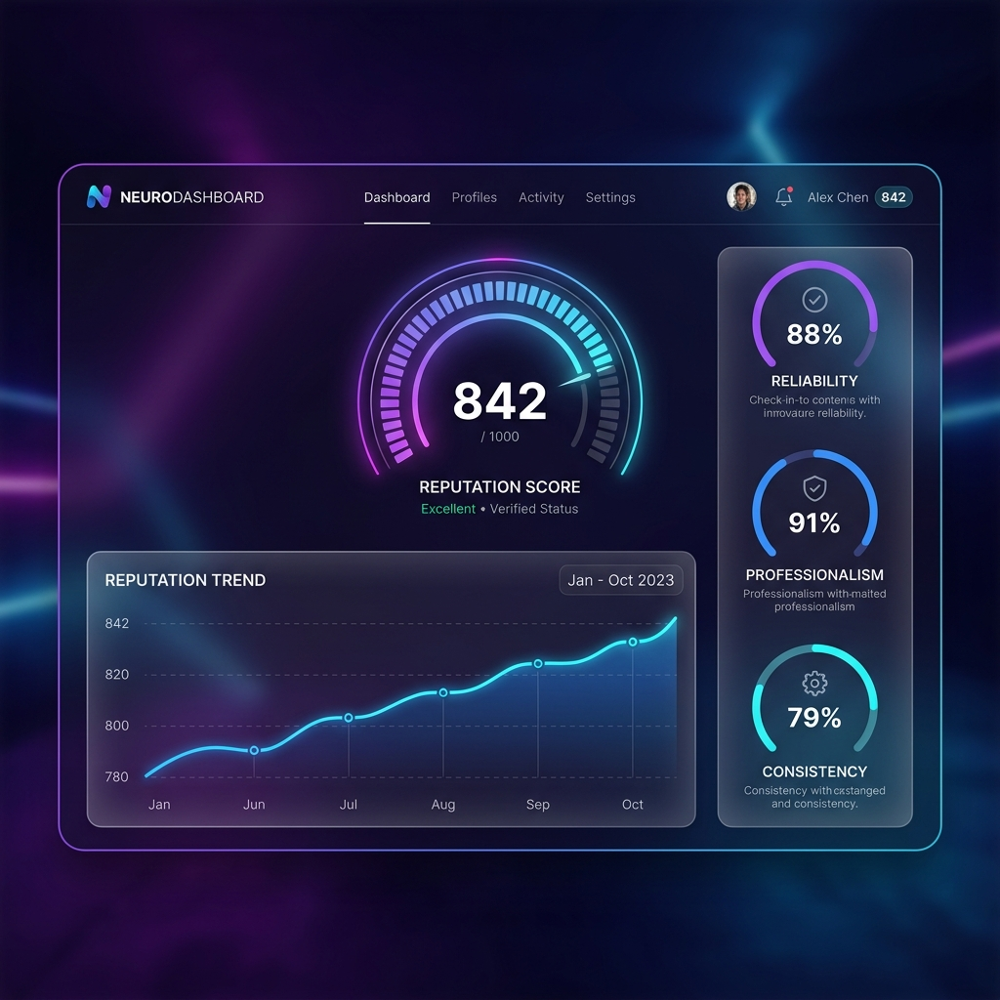

# 🛡️ Reputation Score Platform

[](https://vitejs.dev/)
[](https://reactjs.org/)
[](https://www.typescriptlang.org/)

Reputation Score Platform is a high-fidelity trust and reputation scoring system designed to quantify **Reliability**, **Professionalism**, and **Consistency**. Built with a focus on mathematical integrity and premium aesthetics, it provides a transparent yet robust mechanism for assessing trust in digital ecosystems.



## ✨ Features

-   **Bayesian Reputation Engine**: Advanced scoring logic that handles low-data scenarios gracefully.
-   **Time-Decay Dynamics**: Newer interactions carry more weight, ensuring scores reflect current performance.
-   **Multi-Pillar Analysis**: Separate tracking for Reliability, Professionalism, and Consistency.
-   **Anti-Gaming Measures**: Built-in logic to detect and mitigate reputation manipulation.
-   **Premium Glassmorphism UI**: A stunning, responsive dashboard designed for clarity and impact.

## 🧠 Mathematical Foundation

The platform utilizes a **Weighted Bayesian Average with Exponential Time Decay** to ensure stability and accuracy.

### 1. Exponential Time Decay
Interaction weights ($W_t$) decrease over time according to:
$$W_t = e^{-\lambda \Delta t}$$
Where $\lambda$ is the decay constant and $\Delta t$ is the age of the interaction.

### 2. Bayesian Smoothing
To prevent volatile swings for new users, we apply Bayesian smoothing:
$$Score = \frac{\sum (v_i \cdot w_i) + m \cdot \mu}{\sum w_i + m}$$
-   $v_i$: Value of interaction
-   $w_i$: Combined weight (time + rater)
-   $m$: Confidence factor (platform inertia)
-   $\mu$: Platform mean (baseline)

### 3. Core Pillars
| Pillar | Weight | Description |
| :--- | :--- | :--- |
| **Reliability** | 40% | Completion rates, punctuality, and SLA adherence. |
| **Professionalism** | 30% | Feedback sentiment and communication quality. |
| **Consistency** | 30% | Stability of performance metrics over time. |

## 🚀 Getting Started

### Prerequisites
- Node.js (v18+)
- npm or yarn

### Installation

1. **Clone the repository**:
    ```bash
    git clone https://github.com/Ananthapadmanabhan333/Reputation-score-Platform.git
    cd Reputation-score-Platform
    ```

2. **Install dependencies**:
    ```bash
    npm install
    ```

3. **Run the development server**:
    ```bash
    npm run dev
    ```

## 🛠️ Tech Stack

-   **Framework**: React 18
-   **Build Tool**: Vite
-   **Logic**: TypeScript
-   **Styling**: Premium Vanilla CSS (Glassmorphism)
-   **Charts**: Chart.js / Recharts
-   **Animations**: Framer Motion
-   **Icons**: Lucide React

## 📄 License

This project is licensed under the MIT License - see the [LICENSE](LICENSE) file for details.

---

Built with ❤️ by [Ananthapadmanabhan](https://github.com/Ananthapadmanabhan333)
